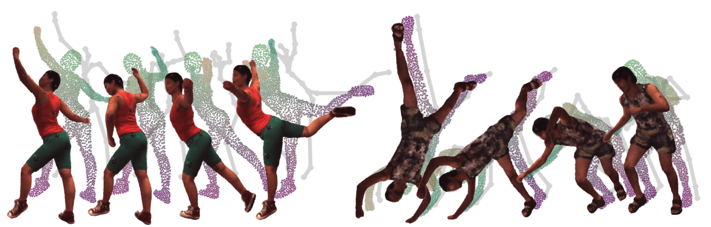

# NPC: Neural Point Characters from Video
### [Paper](https://https://arxiv.org/abs/2304.02013) | [Supplementary](https://lemonatsu.github.io/files/npc/supp.pdf) | [Website](https://lemonatsu.github.io/npc/) 

>**NPC: Neural Point Characters from Video**\
>[Shih-Yang Su](https://lemonatsu.github.io/), [Timur Bagautdinov](https://scholar.google.ch/citations?user=oLi7xJ0AAAAJ&hl=en), and [Helge Rhodin](http://helge.rhodin.de/)\
>ICCV 2023

This repo also supports [DANBO](https://github.com/LemonATsu/DANBO-pytorch) training.

## Setup
```
conda create -n npc python=3.8
conda activate npc

# install pytorch for your corresponding CUDA environments
pip install torch

# install pytorch3d: note that doing `pip install pytorch3d` directly may install an older version with bugs.
# be sure that you specify the version that matches your CUDA environment. See: https://github.com/facebookresearch/pytorch3d
conda install -c fvcore -c iopath -c conda-forge fvcore iopath
pip install --no-index --no-cache-dir pytorch3d -f https://dl.fbaipublicfiles.com/pytorch3d/packaging/wheels/py39_cu114_pyt1110/download.html

# install other dependencies
pip install -r requirements.txt

```
## Training
We provide template training configurations in `configs/` for different settings. 

To train NPC, we need to first extract surface point clouds. You can download pre-extracted point clouds (TODO:) [here]() or modify our [example script](https://github.com/LemonATsu/NPC-pytorch/blob/main/point_extraction.sh) for extracting point clouds with DANBO.

```
./point_extraction.sh # extract point clouds with DANBO
```

Then, you can train NPC with the following command:
```
python train.py --config-name npc --basedir logs  expname=NPC_h36m_S9 dataset.subject=S9
```
The `config-name npc` corresponds to config file `configs/npc.yaml`, and `dataset.subject=S9` overwrite dataset related configuration, which can be found in `configs/dataset/`. The training logs and checkpoints will be saved in `logs/NPC_h36m_S9/`.

Note that you can change the paths to the point clouds in the config (e.g., [here](https://github.com/LemonATsu/NPC-pytorch/blob/main/configs/npc.yaml#L15)).

## Testing
You can use [`run_render.py`](run_render.py) to render the learned models under different camera motions, or retarget the character to different poses by
```
python run_render.py --config-name h36m_zju model_config=logs/NPC_h36m_S9/config.yaml +ckpt_path=[path/to/specific/ckpt] output_path=[path/to/output] render_dataset.bkgd_to_use=black
```
Here, we render the dataset as specified in config file `configs/render/h36m_zju.yaml` with the model configuration and weights we saved before, and store the output in `output_path`.
	
We also provide a config `configs/render/h36m_zju_mesh.yaml`for extracting meshes with Marching cubes.

## Dataset
We are not allowed to share the pre-processed data for H3.6M and MonoPerfcap due to license terms. If you need access to the pre-trained models and the pre-processed dataset, please reach out to `shihyang[at]cs.ubc.ca`.


## Citation
```
@inproceedings{su2023iccv,
    title={NPC: Neural Point Characters from Video},
    author={Su, Shih-Yang and Bagautdinov, Timur and Rhodin, Helge},
    booktitle={International Conference on Computer Vision},
    year={2023}
}
```
```
@inproceedings{su2022danbo,
    title={DANBO: Disentangled Articulated Neural Body Representations via Graph Neural Networks},
    author={Su, Shih-Yang and Bagautdinov, Timur and Rhodin, Helge},
    booktitle={European Conference on Computer Vision},
    year={2022}
}
```

